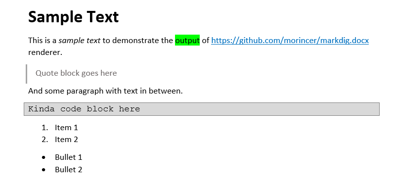

# Markdig-DocX

[](https://github.com/morincer/markdig.docx/actions/workflows/dotnet.yml)
[](https://www.nuget.org/packages/Morincer.Markdig.Renderers.Docx/)

A Docx renderer for the excelent [Markdig](https://github.com/xoofx/markdig) parser.

The renderer allows to output markdown text into an OpenXml-compliant word processing document (Microsoft Word's docx as an example).

So you transform something like [this markdown](./src/Markdig.Renderers.Docx.Tests/Resources/sample-text.md) into something like this Word document:



**Main features**:

* Direct manipulation with the document using good old OpenXml SDK API
* Ability to "inject" multiple markdown snippets into an existing document
* All the formatting is done with styles providing great flexibility in visual appearance

**Curently supported Markdown elements** (to be extended in future):
  * Headings (up to the level 6)
  * Text formatting: **emphasis**, *italic*, ~~strikethrough~~, ~subscript~, ^superscript^
  * Text highlighting: +added+, =marked=
  * Code blocks and code fences
  * External hyperlinks, both explicit and automatic
  * Block quotes
  * Ordered and bulleted lists (single- and multi-level)
  * Horizontal line breaks


**Not currently supported:**

* Internal links (aka cross-references)
* Pictures embedding
* Various format extensions (tables, grids etc.)

## Installation

Fetch from NuGet.

```bash
Install-Package Morincer.Markdig.Renderers.Docx 
```

## How to Use

More usage scenarios are presented in [Tests](./src/Markdig.Renderers.Docx.Tests/TestDocxDocumentRenderer.cs)

Markdown snippets for supported constructs are also located [there](./src/Markdig.Renderers.Docx.Tests/Resources).

### Example 1. Quick Render Using Standard Template and Styles

There is a [standard template](./src/Markdig.Renderers.Docx/Resources/markdown-template.docx) provided with the package - it is contains definitions 
of all the currently used styles. The names of the standard template's styles are defaulted in DocumentStyles class used for rendering. 

Meanwhile you're free to override any of these, it's advised to start with the standard template and just alter it as per your needs - Word's styling sometimes is not trivial.

Please note, that although the standard template document contains some body text (to demonstrate the formatting) it is being cut on loading.

```c#
var document = DocxTemplateHelper.Standard; // Load standard template
var styles = new DocumentStyles(); // Use standard styles

// create a renderer (with null logger)
var renderer = new DocxDocumentRenderer(document, styles, NullLogger<DocxDocumentRenderer>.Instance);

// build pipeline if you need extra emphasis features
var pipeline = new MarkdownPipelineBuilder().UseEmphasisExtras().Build();
// Run the convertion
Markdown.Convert(markdownString, renderer, pipeline);  
```

### Example 2. Load Your Own Template

If (when) you decided to use your own document for a template, you need to load it and prepare yourself.

There are couple of helper methods defined in [DocxTemplateHelper](./src/Markdig.Renderers.Docx/DocxTemplateHelper.cs) class to make the life easier. 

Namely:

* LoadFromResource - load the document from an embedded resource, optionally cleaning it's body
* CleanContents - remove everything from the document's body
* FindParagraphContainingText - find a paragraph with certain text - to be used for insert point positioning.

After your document is loaded, you can define the exact position to insert the markdown contents 
(by default, the text is inserted after the last identified paragraph). You do this by interacting with the *Cursor* property of the renderer.

```c#
/* The template contains a paragraph with text INSERT to be used as a text position */
// Load document from resources
var document = DocxTemplateHelper.LoadFromResource("Markdig.Renderers.Docx.Tests.Resources.docx.template-to-insert.docx");

// Find paragraph to be used as an insert position
var paragraph = DocxTemplateHelper.FindParagraphContainingText(document, "INSERT");

// Instantiate renderer with default styles and no logger        
var renderer = new DocxDocumentRenderer(document);
// set insert position to be after the paragraph found above
renderer.Cursor.SetAfter(paragraph);
// Do the rendering
Markdown.Convert("**Markdown Paragraph 1 - bold** text\n\nParagraph2", renderer);
// Remove the insert position paragraph from the document        
paragraph!.Remove();
```

## Styling

All the default styles used are listed in the [standard template](./src/Markdig.Renderers.Docx/Resources/markdown-template.docx), 
these styles are all prefixed with "MD ".

It is recommended just stick to these styles in your own documents (just copy-paste-then-delete text from the standard template to inject styles).

If you decided to change the styling, please note the following:
* You'll need to set properties in DocumentStyles to match your style names
* Be careful when defining styles for lists - they're really tricky in MS Word and quite easy to mess. 

### Convert Markdown to DOCX Directly In-Memory

If you need to generate a DOCX file in memory (for example, to return it in an HTTP response or save it without writing to disk), you can use the helper method:

```csharp
using Markdig.Renderers.Docx;

// Basic conversion: markdown → MemoryStream containing DOCX
var docxStream = MarkdownExtensions.ToDocxStream("# Title\n\nSample text");

// Optionally, save the stream to a file
using (var file = File.Create("output.docx"))
{
    docxStream.CopyTo(file);
}
```

#### Available Parameters

The method accepts up to three parameters:

- `string markdown`: **Required.** The markdown text to convert.
- `DocumentStyles? styles`: **Optional.** A custom styles object to apply to the document (you can use `new DocumentStyles()` and override properties, e.g. to change heading style names).
- `MarkdownPipeline? pipeline`: **Optional.** A custom Markdig pipeline to enable extra extensions or parsing behavior.

#### Advanced Example: Custom Styles and Pipeline

```csharp
using Markdig;
using Markdig.Renderers.Docx;

// Define custom styles if needed
var styles = new DocumentStyles
{
    Heading1 = "MyCustomHeading1",
    Paragraph = "MyCustomParagraph"
    // ...other overrides as needed
};

// Build a custom Markdig pipeline with extra extensions
var pipeline = new MarkdownPipelineBuilder()
    .UseEmphasisExtras()
    .UsePipeTables()
    .Build();

// Conversion with optional parameters
var docxStream = MarkdownExtensions.ToDocxStream(
    "# Custom Title\n\nSample text",
    styles,
    pipeline
);
```

> ℹ️ If you don't provide `DocumentStyles` or `MarkdownPipeline`, default styles and a basic pipeline with extra emphasis support will be used.

#### Quick Reference

```csharp
public static MemoryStream ToDocxStream(
    string markdown,
    DocumentStyles? styles = null,
    MarkdownPipeline? pipeline = null
)
```

This method creates an in-memory `.docx` file using the standard template included with the library. You can handle the resulting stream as you prefer (save, send via HTTP, etc).
